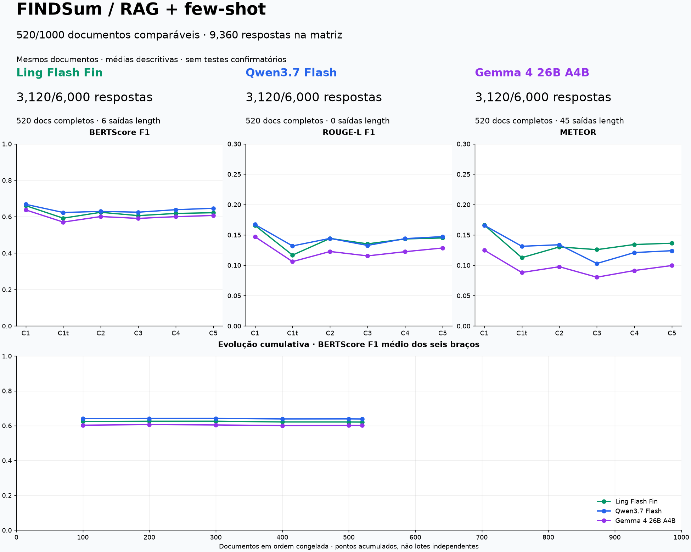

# FINDSum: sumarização financeira com RAG e few-shot

Projeto de pós-graduação que compara seis configurações de sumarização no **FINDSum Liquidity**. Preparação, recuperação e métricas são locais; a geração usa a API do **OpenRouter**.

## Resultados



**520 documentos concluídos nos três modelos: 9.360 respostas e scores.** O painel apresenta as médias descritivas por braço e modelo. Ainda não há teste confirmatório das hipóteses: ele depende da coorte final completa.

- [Painel atual, tabela e evolução cumulativa](results/progress/README.md)
- [Auditoria congelada dos 520 documentos e custo da rodada 321–520](results/audit520/README.md)
- [Auditoria dos 320 documentos e figura dos cinco contrastes](results/article320/README.md)
- [Interpretação dos primeiros 100 documentos](docs/metricas-primeiros100-20260927.md)
- [Snapshot dos scores e IDs dos primeiros 100](results/first100-20260927/)
- [Como as métricas são atualizadas](docs/metricas-automaticas.md)
- [Rodada 161–320 de 28/09: execução, custos e adendo do Ling pago](results/progress/rodada-161-320-20260928.md)

## Executar uma rodada

Na raiz do repositório, com Python 3.12 e `uv`:

```bash
uv sync --locked
bash rodar_rodada.sh 100 --dry-run  # valida sem chamadas de geração
bash rodar_rodada.sh 100            # executa/retoma o mesmo grupo nos três modelos
bash rodar_rodada.sh --metrics-only # atualiza apenas métricas e painel, sem API
```

A preparação integral já existe neste workspace em `outputs/full-{ling,qwen,gemma}-prepared`. Uma nova instalação precisa do dataset, dos modelos locais e desses artefatos preparados; eles não estão no Git. O caminho da credencial é `../.env`, variável `OPEN_ROUTER_KEY`. Nunca adicione esse arquivo ao repositório.

Cada documento tem **seis gerações por modelo**, além de retries. O script preserva a rodada incompleta e as respostas aceitas. Só avança para outro grupo na próxima invocação após a rodada atual estar completa. Os primeiros 520 estão gerados e pontuados; a próxima execução normal seleciona os documentos ainda não processados.

A execução normal envia chamadas pagas de Qwen/Gemma. `--dry-run`, `--metrics-only` e `--audit-ling-batch 1` são modos locais. Não apague `outputs/full-rounds/active-round.json`, os ledgers ou as pastas de respostas para tentar avançar.

| Modelo / provedor fixo | Ritmo máximo | Teto cumulativo de geração |
|---|---:|---:|
| Ling 3.0 Flash Fin gratuito / Novita | 20 RPM | US$ 0 |
| Ling 3.0 Flash Fin pago / Novita, apenas rodadas com adendo registrado | 500 RPM, adaptativo | US$ 3,70 cumulativo após 321–520 |
| Qwen3.7 Flash / Alibaba | 500 RPM, adaptativo | US$ 18 |
| Gemma 4 26B A4B / Darkbloom | 500 RPM, adaptativo | US$ 9 |

Os tetos não garantem vazão sustentada ou conclusão com esse saldo. Nos pagos, erros transitórios reduzem ritmo/concorrência, respeitam `Retry-After` e voltam à fila, com até seis tentativas por ciclo. Resultado de transporte desconhecido ou resposta fora do contrato exige auditoria. Não há troca automática de modelo/provedor. O Ling pago foi autorizado para as rodadas [161–320](configs/ling-paid-round-161-320.json) e [321–520](configs/ling-paid-round-321-520.json), cada uma em adendo separado; o comportamento padrão das próximas rodadas continua gratuito. O adendo 321–520 também fixou tetos incrementais por modelo, somando US$ 7,00, sobre o custo retido das tentativas. Uma nova rodada paga exige novo adendo antes da execução.

Ao encerrar, o Bash atualiza `results/progress/` usando somente o prefixo completo comum aos três modelos. Usa cache para evitar recálculo. Não faz commit ou push automaticamente:

```bash
git add results/progress
git commit -m "results: atualiza acompanhamento do experimento"
git push origin main
```

## Organização

```text
src/findsum_rag/       Biblioteca: dados, RAG, prompts, API e métricas
scripts/
  data/               Download do FINDSum e criação de splits
  preparation/        Prompts, tokenizers, preflight e congelamento
  execution/          Rodadas, lotes, concorrência e retomada
  evaluation/         Métricas, auditoria e painel incremental
  reports/            Exportadores e templates de relatórios locais
  experiments/        PoCs, diagnósticos e benchmarks auxiliares
  common/             Contratos compartilhados dos scripts
configs/              Configuração, coorte e locks de integridade
tests/                Testes automatizados
results/              Métricas e gráficos versionados
docs/                 Guias e interpretação das métricas
outputs/              Artefatos locais e notas históricas (fora do Git)
```

Os scripts são módulos Python; use `python -m scripts.<grupo>.<modulo>`. [Comandos e responsabilidades](scripts/README.md). Os comandos `findsum` e o Bash continuam sendo as entradas principais. Os módulos científicos em `src/findsum_rag/` mantêm seus caminhos.

Os HTMLs gerados ficam em `outputs/reports/`. Notas de execução, diagnósticos e documentos antigos foram retirados da árvore atual do Git; o histórico de commits permanece disponível. A reorganização local preservou cópias em `outputs/arquivo-local/`.

## Método do experimento

FINDSum Liquidity, em inglês: 1.000 exemplos, 500 documentos dev e 1.000 eval, separados por empresa no [manifesto](data/interim/splits-liquidity.json). A [coorte final](configs/full-eval-cohort.csv) tem ordem sorteada com semente 42, sem reposição ou seleção por qualidade. “Fonte inteira” é o extrato disponível no FINDSum, com prosa e tabelas brutas da tarefa, não o 10-K original completo.

| Braço | Contexto e exemplos |
|---|---|
| C1 | Fonte inteira, sem exemplos |
| C1t | Prefixo com orçamento de contexto e prompt zero-shot iguais aos de C2 |
| C2 | Contexto recuperado por RAG, sem exemplos |
| C3 | Mesmo RAG + quatro exemplos fixos |
| C4 | Mesmo RAG + quatro exemplos aleatórios, com semente por documento |
| C5 | Mesmo RAG + quatro exemplos por similaridade |

RAG local com MiniLM-L6-v2, FAISS, chunks de 220 palavras, sobreposição de 40, até 12 chunks e orçamento de contexto de 3.072 tokens. Embeddings em janelas cobrem toda a prosa. A referência do alvo não entra na recuperação ou no prompt; os exemplos vêm de banco separado. C2–C5 compartilham o contexto recuperado dentro de cada modelo.

Prompts orientam até 750 palavras; reserva de saída de 8.192 tokens. Todos os prompts são pré-validados; overflow bloqueia a execução, sem truncar C1, exemplos ou instruções. Saídas `length` são mantidas e sinalizadas. Não repetir respostas por baixa qualidade.

As métricas primárias são **BERTScore F1 e ROUGE-L F1**; BERTScore precisão/recall, ROUGE-1/2 e METEOR são descritivas. BERTScore usa XLNet-base-cased, camada 5, sem IDF/reescala e com auditoria de cobertura integral, sem corte em 512 tokens. Similaridade não é porcentagem de correção factual; não há avaliação numérica ou revisão humana no protocolo atual.

Contrastes: **H1=C2−C1; H1b=C2−C1t; H2=C3−C2; H3=C4−C3; H4=C5−C4.** Na análise final: Wilcoxon bilateral, Holm sobre dez testes por modelo (cinco contrastes × duas métricas), alfa 0,05; dados incompletos são rejeitados. H3 é controle de sensibilidade: não significância não demonstra equivalência. Nenhuma hipótese está confirmada pelo recorte parcial. A avaliação usa empresas reservadas dentro do FINDSum, não demonstra generalização para outro corpus.

Coorte, parâmetros e versões permanecem congelados. Não ajustar o protocolo com base nas métricas parciais da avaliação. [Configuração científica](configs/full_openrouter.yaml) · [Modelos e limites](configs/openrouter_full.json).

## Verificação

```bash
uv run --locked findsum verify-full
uv run --locked pytest -q -m 'not slow' --ignore=tests/test_real_data.py
uv run --locked ruff check src scripts tests
```

O lock verifica código, dados, modelos locais, versões e compatibilidade dos artefatos preparados antes da geração. A migração de caminhos está documentada por hashes em `configs/repository-layout.json`; ela não autoriza alterações nos insumos científicos.

Esta revisão passou na suíte automatizada sem `slow` e `test_real_data.py`, no Ruff e na verificação do lock. Os 9.360 scores têm IDs únicos e auditoria sem truncamento; os 5.760 scores anteriores permaneceram idênticos.
