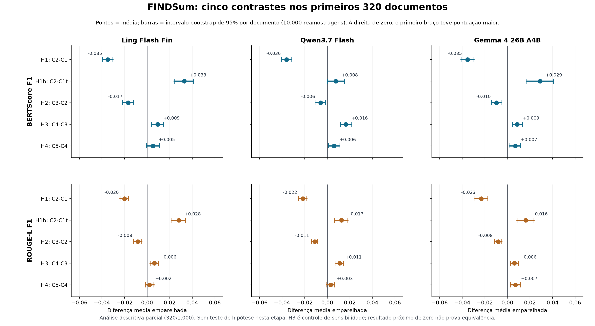

# Auditoria e resultados parciais: 320 documentos



Esta é a análise **descritiva** dos primeiros 320 documentos da coorte `eval` de 1.000 documentos congelada em [`configs/full-eval-cohort.csv`](../../configs/full-eval-cohort.csv). Há uma empresa por documento na coorte. Os mesmos documentos têm seis respostas aceitas em cada um dos três modelos: **5.760 gerações e 5.760 linhas de métricas**. Nenhuma chamada à API foi feita para esta auditoria. A figura também está em [SVG](contrasts-320.svg) e [PDF](contrasts-320.pdf); os [30 contrastes e intervalos](contrasts.csv) e os [scores congelados](scores-320.csv) estão em CSV. O gráfico lê esse snapshot para permanecer estável quando o painel cumulativo avançar.

## O que o experimento responde

Há **seis configurações**, mas **cinco contrastes predefinidos**: H1 = C2−C1; H1b = C2−C1t; H2 = C3−C2; H3 = C4−C3; H4 = C5−C4. As duas métricas primárias são BERTScore F1 e ROUGE-L F1. H3 mede a sensibilidade à escolha de exemplos fixos versus aleatórios; um resultado não significativo ao final não demonstraria equivalência. A análise confirmatória predefinida usa Wilcoxon emparelhado bilateral e Holm sobre os dez testes **por modelo**, somente após os 1.000 documentos. Os intervalos bootstrap nesta figura descrevem a incerteza das médias parciais; **não** são testes confirmatórios nem ajustados para a família de dez testes.

| Modelo | Contraste | Δ BERTScore F1 | Δ ROUGE-L F1 |
|---|---|---:|---:|
| Ling Flash Fin | H1: C2−C1 | −0,0348 | −0,0201 |
| Ling Flash Fin | H1b: C2−C1t | +0,0329 | +0,0280 |
| Ling Flash Fin | H2: C3−C2 | −0,0168 | −0,0082 |
| Ling Flash Fin | H3: C4−C3 | +0,0094 | +0,0064 |
| Ling Flash Fin | H4: C5−C4 | +0,0051 | +0,0022 |
| Qwen3.7 Flash | H1: C2−C1 | −0,0361 | −0,0217 |
| Qwen3.7 Flash | H1b: C2−C1t | +0,0076 | +0,0126 |
| Qwen3.7 Flash | H2: C3−C2 | −0,0058 | −0,0110 |
| Qwen3.7 Flash | H3: C4−C3 | +0,0164 | +0,0110 |
| Qwen3.7 Flash | H4: C5−C4 | +0,0059 | +0,0031 |
| Gemma 4 26B A4B | H1: C2−C1 | −0,0353 | −0,0232 |
| Gemma 4 26B A4B | H1b: C2−C1t | +0,0288 | +0,0162 |
| Gemma 4 26B A4B | H2: C3−C2 | −0,0098 | −0,0081 |
| Gemma 4 26B A4B | H3: C4−C3 | +0,0087 | +0,0063 |
| Gemma 4 26B A4B | H4: C5−C4 | +0,0069 | +0,0071 |

Nos três modelos, C2 pontuou abaixo da fonte integral C1, mas acima do prefixo de mesmo orçamento C1t. Isso separa duas perguntas: substituir a fonte inteira por RAG perdeu similaridade textual; dentro do orçamento reduzido, a recuperação foi geralmente melhor que usar o início do relatório. Acrescentar quatro exemplos fixos (C3) reduziu as duas métricas primárias frente a C2. Os exemplos aleatórios (C4) recuperaram parte dessa diferença frente a C3. A vantagem média de exemplos similares (C5) sobre aleatórios (C4) foi pequena e alguns intervalos bootstrap incluem zero. Essas observações **não confirmam nem refutam as hipóteses finais**.

O [recorte por rodada](wave-contrasts.csv) separa documentos 1–160 e 161–320. No Ling, os primeiros 160 usaram `inclusionai/ling-3.0-flash-fin:free` e os seguintes usaram a versão paga do mesmo modelo no mesmo provedor Novita, conforme [`configs/ling-paid-round-161-320.json`](../../configs/ling-paid-round-161-320.json). Os documentos também mudam entre as rodadas, portanto diferenças de médias entre elas **não isolam** efeito do endpoint. Qwen usa Alibaba e Gemma usa Darkbloom; comparações entre modelos são observacionais, sem controle de arquitetura, tokenizer ou provedor.

## Integridade verificada

O [relatório de auditoria](audit.json), produzido por [`audit.py`](audit.py), verificou a identidade e a ordem da coorte, a ausência de empresas comuns entre os splits de exemplos/dev/eval, a igualdade dos documentos preparados entre modelos e a integridade dos hashes dos prompts preparados. Para todos os 1.000 documentos preparados por modelo, conferiu que C1 contém a fonte integral, C1t é prefixo dessa fonte, C1t e C2 usam o mesmo número de tokens de contexto e de prompt zero-shot, e C2–C5 recebem contexto RAG idêntico. Os exemplos de C3–C5 têm quatro IDs distintos pertencentes apenas ao split de exemplos; C3 permanece fixo.

Para as 5.760 gerações aceitas, a auditoria vinculou o ledger, a requisição salva, a resposta bruta, o prompt do preflight, o texto/referência limpos, a entrada do cache de métricas e a linha do [snapshot de scores](scores-320.csv). Conferiu esse snapshot contra o [painel cumulativo](../progress/scores.csv) e, enquanto este estava em 320 documentos, recalculou suas médias publicadas. Todas as 5.760 avaliações BERTScore registraram texto integral, sem truncamento. O maior prompt preparado por modelo foi 43.743 tokens (Ling), 43.338 (Qwen) e 43.088 (Gemma), abaixo do limite conservador de 49.152. Houve 20 respostas com `finish_reason=length`: 3 Ling e 17 Gemma. Elas foram mantidas e sinalizadas, como definido no protocolo; podem reduzir a qualidade observada e precisam ser relatadas no artigo.

A auditoria rápida não recalcula os embeddings nem todas as 5.760 inferências BERTScore; ela confere os artefatos congelados e a linhagem dos scores. Como checagem pontual adicional, ROUGE/METEOR foram recalculados de cinco respostas brutas, incluindo duas saídas `length`, e BERTScore P/R/F1 de três respostas normais em CPU; os valores publicados coincidiram. A reprodução integral das métricas permanece disponível pelo comando abaixo.

O [manifesto SHA-256 dos pedidos e respostas](raw-artifact-manifest.csv) permite conferir integridade posterior. **O Git não contém os textos brutos nem os documentos preparados**: eles estão em `outputs/` (cerca de 4,5 GB para os três modelos). O Git preserva scores, configuração, código, coorte, lock, auditoria e hashes, mas **não basta sozinho para recomputar os scores a partir das saídas**. Antes de depositar os dados do artigo, arquivar os `outputs/full-*-batches/`, `outputs/full-*-prepared/` e o cache/método de métricas, verificar os hashes e disponibilizar um local durável de acesso. A geração usa temperatura zero, porém não envia `seed` à API; reexecutar a geração pode não produzir bytes idênticos. As respostas já salvas permitem recomputar as métricas localmente.

O DOCX inicial formula também qualidade factual e preservação numérica. A execução atual, por decisão do protocolo, **mede similaridade com a referência**, não verifica a verdade das afirmações nem a correção dos números. O artigo deve limitar as conclusões a essa definição operacional de qualidade; BERTScore/ROUGE não sustentam alegações de fidelidade factual ou numérica. O `eval` é reservado por empresa **dentro do FINDSum**, sem teste de generalização fora desse dataset.

## Reproduzir esta auditoria sem API

Na raiz do repositório, com os artefatos locais preservados:

```bash
uv run --locked findsum verify-full
uv run --locked python results/article320/audit.py
uv run --locked python results/article320/figure.py
```

Para recalcular as métricas desde as respostas brutas, execute `bash rodar_rodada.sh --metrics-only`. Este último comando pode levar mais tempo se o cache tiver sido removido, mas não solicita novas gerações. O gráfico usa as diferenças por documento, média e 10.000 reamostragens bootstrap de documentos com semente 20260929. Fonte: [`figure.py`](figure.py).
