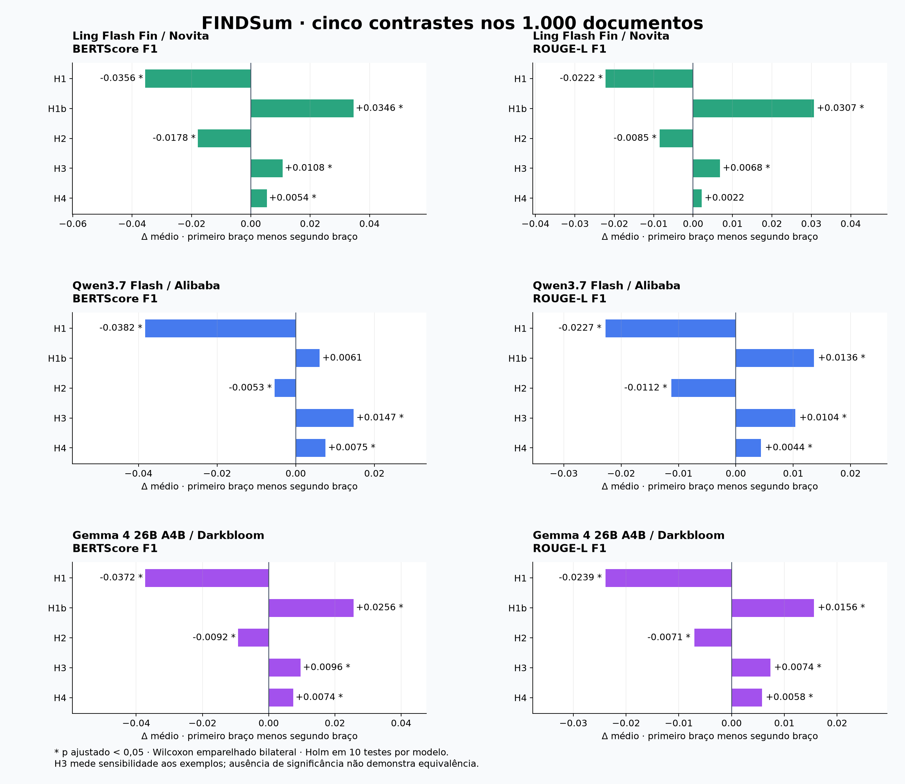

# Experimento completo: 1.000 documentos

A coorte congelada está completa nos três modelos: **18.000 respostas aceitas e 18.000 scores únicos**. A rodada 521–1000 acrescentou 480 documentos, com 2.880 respostas novas por modelo. As 9.360 respostas e os scores dos primeiros 520 documentos permaneceram preservados.



[Figura vetorial ampliável](contrastes.svg) · [Médias por braço e modelo](../progress/README.md) · [Scores individuais](../progress/scores.csv)

## Custos da rodada 521–1000

| Modelo / provedor | Respostas novas | Saídas `length` | Custo aceito reportado | Custo retido | Teto da rodada |
|---|---:|---:|---:|---:|---:|
| Ling Flash Fin / Novita | 2.880 | 5 | US$ 2,2360 | US$ 2,3743 | US$ 3,2000 |
| Qwen3.7 Flash / Alibaba | 2.880 | 0 | US$ 4,7490 | US$ 4,9211 | US$ 7,3000 |
| Gemma 4 26B A4B / Darkbloom | 2.880 | 42 | US$ 3,0542 | US$ 3,1122 | US$ 3,5000 |
| **Total** | **8.640** | **47** | **US$ 10,0392** | **US$ 10,4076** | **US$ 14,0000** |

Saldo consultado antes da rodada: **US$ 14,2832**; ao final: **US$ 4,2149**. A variação observada na conta foi **US$ 10,0683**. A diferença de US$ 0,0291 em relação às respostas aceitas não pode ser atribuída com precisão a chamadas individuais.

A interrupção da execução inicial deixou 45 pedidos do Ling sem resposta salva. Seus requests foram auditados e preservados; a retomada registrou novas tentativas e manteve a reserva máxima dos pedidos interrompidos. Qwen teve 21 erros 429; Gemma teve 11 erros 429 e quatro outros erros transitórios. Todos os casos têm uma única resposta aceita. Custo retido é uma reserva conservadora, não uma cobrança: usa o custo reportado das respostas aceitas e o máximo permitido para as demais tentativas.

Os primeiros 160 documentos do Ling usam o endpoint gratuito original; os outros 840 usam o pago, sempre no Novita. Essa transição deve ser declarada no artigo; não foi testada equivalência entre níveis de serviço. O [adendo desta rodada](../../configs/ling-paid-round-521-1000.json) mantém prompts, coorte, recuperação, exemplos e parâmetros congelados.

## Testes das hipóteses

Cinco contrastes × duas métricas primárias = **dez testes por modelo**, com **1.000 pares** em cada teste. Usamos Wilcoxon bilateral emparelhado e Holm dentro de cada família de dez testes, alfa 0,05. Os testes publicados foram calculados diretamente sobre o CSV versionado; sua direção e decisão de significância coincidem com os resultados da análise final da pipeline. Δ usa a escala da métrica, não porcentagem de fatos corretos.

| Modelo | Hipótese / braços | Δ BERTScore F1 | p Holm | Δ ROUGE-L F1 | p Holm |
|---|---|---:|---:|---:|---:|
| Ling Flash Fin | H1: C2−C1 | -0.0356 | 9.97e-108 | -0.0222 | 5.74e-70 |
| Ling Flash Fin | H1b: C2−C1t | +0.0346 | 1.69e-33 | +0.0307 | 2.77e-59 |
| Ling Flash Fin | H2: C3−C2 | -0.0178 | 5.3e-18 | -0.0085 | 1.48e-08 |
| Ling Flash Fin | H3: C4−C3 | +0.0108 | 6.85e-09 | +0.0068 | 6.24e-08 |
| Ling Flash Fin | H4: C5−C4 | +0.0054 | 0.00312 | +0.0022 | 0.0732 |
| Qwen3.7 Flash | H1: C2−C1 | -0.0382 | 1.48e-111 | -0.0227 | 6.07e-76 |
| Qwen3.7 Flash | H1b: C2−C1t | +0.0061 | 0.123 | +0.0136 | 2.18e-18 |
| Qwen3.7 Flash | H2: C3−C2 | -0.0053 | 7.45e-07 | -0.0112 | 3.3e-36 |
| Qwen3.7 Flash | H3: C4−C3 | +0.0147 | 1.58e-26 | +0.0104 | 8.45e-26 |
| Qwen3.7 Flash | H4: C5−C4 | +0.0075 | 1.53e-07 | +0.0044 | 0.000128 |
| Gemma 4 26B A4B | H1: C2−C1 | -0.0372 | 2.31e-92 | -0.0239 | 3.16e-55 |
| Gemma 4 26B A4B | H1b: C2−C1t | +0.0256 | 7.73e-05 | +0.0156 | 3.06e-11 |
| Gemma 4 26B A4B | H2: C3−C2 | -0.0092 | 2.26e-14 | -0.0071 | 1.85e-13 |
| Gemma 4 26B A4B | H3: C4−C3 | +0.0096 | 2.59e-19 | +0.0074 | 4.62e-14 |
| Gemma 4 26B A4B | H4: C5−C4 | +0.0074 | 1.19e-09 | +0.0058 | 1.73e-05 |

**Achados:** C1 supera C2 nas duas métricas e nos três modelos (H1 negativa); quatro exemplos fixos reduzem as duas métricas frente ao RAG sem exemplos (H2 negativa). Os exemplos aleatórios superam os fixos nos três modelos (H3), mostrando sensibilidade à seleção. C5 supera C4 em média, mas H4 no ROUGE-L do Ling não é significativa após Holm (p = 0,0732). O RAG supera o prefixo em média (H1b), mas no BERTScore do Qwen a diferença não é significativa (p = 0,1229). Assim, 28 dos 30 testes detectam diferenças; isso não significa que as cinco hipóteses de melhora tenham sido confirmadas.

[Resultados completos, incluindo tamanho de efeito e p não ajustado](comparisons.csv) · [Plano pré-definido](analysis-plan.json)

A coluna `effect_size` registra a proporção de documentos em que o primeiro braço supera o segundo, excluindo empates; é uma taxa descritiva de vitórias, não um efeito padronizado. H3 é controle de sensibilidade à escolha dos exemplos; um teste sem significância não provaria equivalência. Significância não mede a importância prática do ganho nem estabelece qualidade factual. BERTScore precisão/recall, ROUGE-1/2 e METEOR permanecem descritivos. As saídas `length` foram mantidas; a auditoria confirmou cobertura integral de tokens no BERTScore, sem truncar a entrada dos prompts. Os resultados se referem às empresas reservadas dentro do FINDSum; diferenças entre modelos não isolam arquitetura, tokenizador ou provedor.

## Auditoria e reprodução

[Auditoria JSON](audit.json) · [Manifesto SHA-256 de todos os requests e respostas aceitos](raw-artifact-manifest.csv) · [Snapshot anterior de 520 documentos](../audit520/README.md)

Os textos brutos, contextos, exemplos, respostas, ledgers e logs ficam em `outputs/`, fora do Git. O arquivo de auditoria também registra os hashes dos scores, dos testes e do manifesto. Para repetir a conferência local, são necessários o dataset e os artefatos arquivados, incluindo `outputs/round-521-1000-20260929/` e seus backups. Nenhuma chamada à API é feita pela auditoria.

```bash
uv run --locked python results/audit1000/audit.py
```
