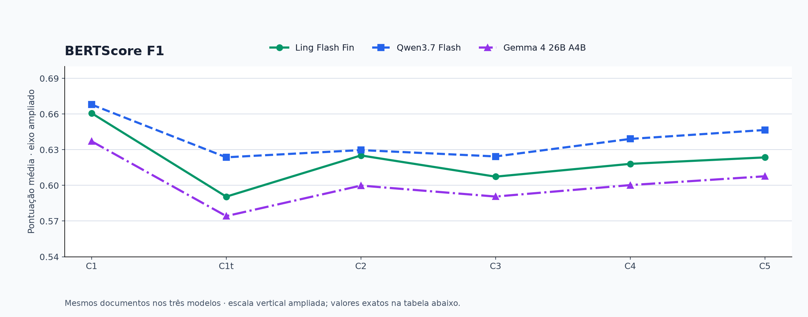
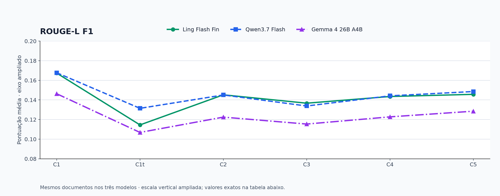
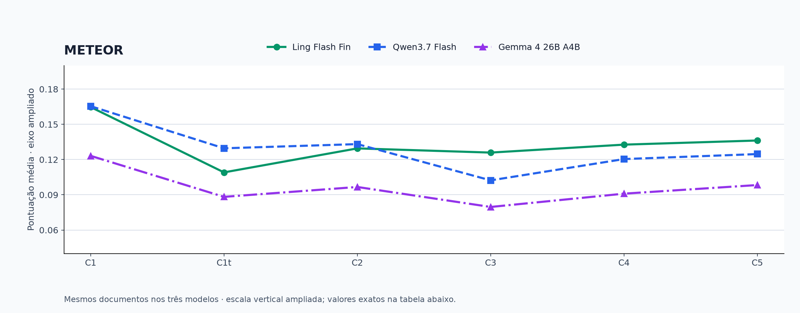
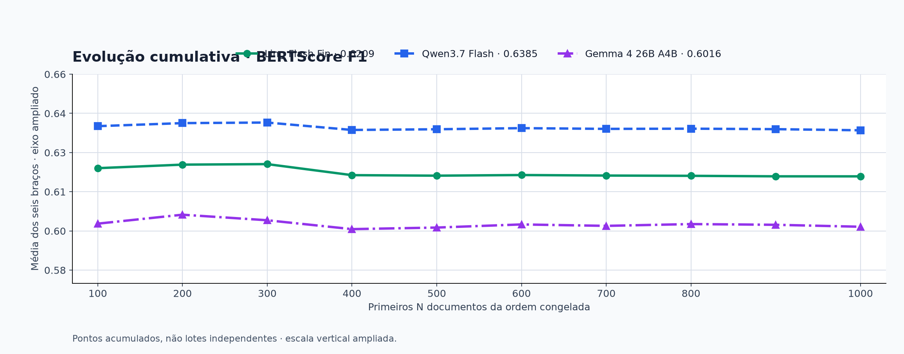

# Acompanhamento do experimento FINDSum

[Experimento completo: 30 testes, custos e auditoria](../audit1000/README.md) · [Comparações em CSV](comparisons.csv)

<!-- readable-progress:start -->

**Gráficos ampliados:** os quatro painéis têm eixos verticais focados na faixa observada e limites visíveis. Abra os SVGs para ampliar sem perda de nitidez.

| Métrica | Figura detalhada | Versão vetorial |
|---|---|---|
| BERTScore F1 | [PNG](bertscore-f1.png) | [SVG](bertscore-f1.svg) |
| ROUGE-L F1 | [PNG](rouge-l-f1.png) | [SVG](rouge-l-f1.svg) |
| METEOR | [PNG](meteor.png) | [SVG](meteor.svg) |
| Evolução cumulativa | [PNG](evolucao.png) | [SVG](evolucao.svg) |

## Hipóteses e contrastes observados

Cada contraste usa os **mesmos documentos** em dois braços. Δ positivo significa maior similaridade média com a referência no primeiro braço; Δ negativo, menor. As diferenças abaixo são pontos da escala 0 a 1, não percentuais de acerto.

| Hipótese | Comparação | Pergunta |
|---|---|---|
| H1 | C2 - C1 | RAG versus fonte inteira |
| H1b | C2 - C1t | RAG versus prefixo de igual orçamento |
| H2 | C3 - C2 | Quatro exemplos fixos versus zero-shot RAG |
| H3 | C4 - C3 | Aleatórios versus fixos: controle de sensibilidade |
| H4 | C5 - C4 | Similares versus aleatórios |

H3 é um **controle de sensibilidade** à escolha dos exemplos: uma diferença não significativa ao final não provaria equivalência. As métricas primárias são BERTScore F1 e ROUGE-L F1; METEOR e BERTScore precisão/recall são descritivos.

**Recorte atual: 1000 documentos por modelo.** Contrastes entre médias dos braços, arredondados a quatro casas:

| Modelo | Hipótese | Δ BERTScore F1 | Δ ROUGE-L F1 |
|---|---|---:|---:|
| Ling Flash Fin | H1 | -0,0356 | -0,0222 |
| Ling Flash Fin | H1b | +0,0346 | +0,0307 |
| Ling Flash Fin | H2 | -0,0178 | -0,0085 |
| Ling Flash Fin | H3 | +0,0108 | +0,0068 |
| Ling Flash Fin | H4 | +0,0054 | +0,0022 |
| Qwen3.7 Flash | H1 | -0,0382 | -0,0227 |
| Qwen3.7 Flash | H1b | +0,0061 | +0,0136 |
| Qwen3.7 Flash | H2 | -0,0053 | -0,0112 |
| Qwen3.7 Flash | H3 | +0,0147 | +0,0104 |
| Qwen3.7 Flash | H4 | +0,0075 | +0,0044 |
| Gemma 4 26B A4B | H1 | -0,0372 | -0,0239 |
| Gemma 4 26B A4B | H1b | +0,0256 | +0,0156 |
| Gemma 4 26B A4B | H2 | -0,0092 | -0,0071 |
| Gemma 4 26B A4B | H3 | +0,0096 | +0,0074 |
| Gemma 4 26B A4B | H4 | +0,0074 | +0,0058 |

Nos três modelos, **H1 é negativa** e **H1b é positiva**: o RAG ficou abaixo da fonte inteira, mas acima do prefixo com o mesmo orçamento de contexto. **H2 é negativa**: quatro exemplos fixos reduziram as duas métricas primárias frente ao RAG sem exemplos. **H3 e H4 são positivas**, com ganho menor em H4. Isso descreve este recorte e não estabelece eficácia causal ou qualidade factual.

**Este painel apresenta diferenças descritivas.** Os testes completos estão na tabela de comparações, calculados a partir do CSV versionado. O plano usa Wilcoxon bilateral emparelhado e Holm sobre dez testes por modelo. As saídas `length` permanecem na análise e podem afetar as médias. Os contrastes entre modelos não isolam arquitetura, tokenizador ou provedor.

<!-- readable-progress:end -->

**1000/1000 documentos no prefixo comum completo.** Atualização local automática pelo Bash, sem chamadas de geração adicionais para as métricas.

Somente os documentos consecutivos da ordem congelada com seis respostas aceitas em todos os modelos entram na matriz. Pendências de um modelo não alteram a base de comparação. Progresso individual aparece nos cartões.

Resultados descritivos: sem p-valores ou confirmação de hipóteses. A rotina confirmatória final permanece separada. BERTScore XLNet-base-cased, camada 5, sem IDF/rescale, textos integrais; ROUGE-L F1; METEOR. Os eixos ampliados e seus limites estão explícitos em cada figura.

| Modelo | Braço | BERT P | BERT R | BERT F1 | ROUGE-L | METEOR |
|---|---|---:|---:|---:|---:|---:|
| Ling Flash Fin | C1 | 0.7302 | 0.6049 | 0.6607 | 0.1674 | 0.1647 |
| Ling Flash Fin | C1t | 0.6559 | 0.5404 | 0.5905 | 0.1145 | 0.1091 |
| Ling Flash Fin | C2 | 0.7033 | 0.5642 | 0.6252 | 0.1452 | 0.1295 |
| Ling Flash Fin | C3 | 0.6806 | 0.5499 | 0.6073 | 0.1367 | 0.1259 |
| Ling Flash Fin | C4 | 0.6921 | 0.5601 | 0.6181 | 0.1435 | 0.1327 |
| Ling Flash Fin | C5 | 0.6990 | 0.5646 | 0.6235 | 0.1457 | 0.1362 |
| Qwen3.7 Flash | C1 | 0.7324 | 0.6158 | 0.6679 | 0.1677 | 0.1654 |
| Qwen3.7 Flash | C1t | 0.6807 | 0.5779 | 0.6236 | 0.1314 | 0.1296 |
| Qwen3.7 Flash | C2 | 0.7042 | 0.5711 | 0.6297 | 0.1450 | 0.1331 |
| Qwen3.7 Flash | C3 | 0.7230 | 0.5515 | 0.6243 | 0.1338 | 0.1023 |
| Qwen3.7 Flash | C4 | 0.7325 | 0.5691 | 0.6391 | 0.1442 | 0.1204 |
| Qwen3.7 Flash | C5 | 0.7412 | 0.5760 | 0.6466 | 0.1485 | 0.1247 |
| Gemma 4 26B A4B | C1 | 0.7156 | 0.5766 | 0.6371 | 0.1463 | 0.1231 |
| Gemma 4 26B A4B | C1t | 0.6739 | 0.5069 | 0.5742 | 0.1068 | 0.0882 |
| Gemma 4 26B A4B | C2 | 0.6832 | 0.5364 | 0.5998 | 0.1224 | 0.0966 |
| Gemma 4 26B A4B | C3 | 0.6942 | 0.5159 | 0.5906 | 0.1154 | 0.0796 |
| Gemma 4 26B A4B | C4 | 0.6996 | 0.5276 | 0.6002 | 0.1227 | 0.0910 |
| Gemma 4 26B A4B | C5 | 0.7056 | 0.5357 | 0.6077 | 0.1285 | 0.0983 |

[Scores por documento](scores.csv) · [Resumo e cobertura](summary.json) · [Histórico cumulativo](history.json)

C1: fonte inteira; C1t: prefixo equiparado a C2; C2: RAG sem exemplos; C3/C4/C5: mesmo RAG com quatro exemplos fixos/aleatórios/similares. Saídas `length` são mantidas. Precisão/recall/F1 são médias individuais, não F1 derivado das médias.

Execute `bash rodar_rodada.sh --metrics-only` para atualizar sem geração. O script não faz commit nem push automaticamente. O cálculo usa cache local por conteúdo e método; artefatos brutos e credenciais não são exportados.

Os pontos históricos são recalculados com os dados atuais e representam médias acumuladas, não réplicas independentes. Não ajustar o protocolo com base neste acompanhamento da coorte eval.
